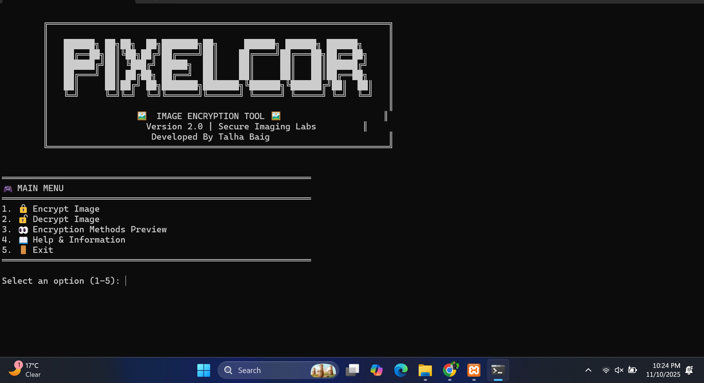

# 🖼️ PixelCrypt Pro - Image Encryption Tool


A powerful image encryption tool that uses pixel manipulation techniques to secure your images. Built with Python and designed for both educational and practical use.

## 🔐 Features

- **🔒 Multiple Encryption Methods**
  - XOR Bit-level Encryption
  - Pixel Swapping Algorithm
  - Value Shifting Technique
  - Advanced Combined Encryption

- **🎨 User-Friendly Interface**
  - Professional CLI with banners
  - Interactive menu system
  - Real-time progress indicators

- **🖼️ Image Format Support**
  - JPEG, PNG, BMP formats
  - Color and grayscale images
  - Lossless encryption/decryption

- **🔧 Technical Features**
  - Key-based security system
  - Error handling and validation
  - Cross-platform compatibility

## 📸 Screenshot



## 🚀 Quick Start

### Prerequisites
- Python 3.6 or higher
- pip (Python package manager)

### Installation

1. **Clone the repository**
   ```bash
   git clone https://github.com/talhabaig007/PixelCrypt-Pro.git
   ```
   ```bash
   cd PixelCrypt-Pro
    ```
2. **Install dependencies**
   ```bash
   pip install numpy pillow
   ```
3. **Run the tool**
   ```bash
   python PixelCrypt.py
   ```
## 🎮 How to Use

**Main Menu Options**
═🎮 MAIN MENU═
1. 🔒 Encrypt Image
2. 🔓 Decrypt Image
3. 👀 Encryption Methods Preview
4. 📖 Help & Information
5. 🚪 Exit

**Encryption Process**
1. Select "Encrypt Image" from menu
2. Enter image file path
3. Choose encryption key (integer)
4. Select encryption method:
   - XOR: Fast bit-level encryption
   - Pixel Swapping: Changes pixel positions
   - Value Shifting: Modifies pixel values
   - Advanced: All methods combined
5. Encrypted image saved as filename_encrypted.png

**Decryption Process**
1. Select "Decrypt Image" from menu
2. Enter encrypted image path
3. Provide the same key used for encryption
4. Select corresponding decryption method
5. Decrypted image saved as filename_decrypted.png

## Supported Image Formats
- ✅ PNG (Recommended)
- ✅ JPEG
- ✅ BMP
- ✅ TIFF
- ✅ GIF

## 🧪 Testing Examples

**Sample Encryption**
- Input Image: sample.jpg
- Encryption Key: 12345
- Method: Advanced Encryption
- Output: sample_encrypted.png
  
**Sample Decryption**
- Input Image: sample_encrypted.png
- Decryption Key: 12345
- Method: Advanced Decryption
- Output: sample_decrypted.png

## 🛡️ Security Information

**Key Security**
- Uses integer keys for encryption
- Same key required for decryption
- Key determines random number generation
- Store keys securely
  
**Security Level**

***Educational Purpose Warning***
- Demonstrates basic cryptography concepts
- Not suitable for highly sensitive data
- Good for learning image processing
- Excellent for academic projects

## 🌐 Compatibility

**Operating Systems**
- ✅ Windows 7/10/11
- ✅ Linux (Ubuntu, CentOS, etc.)
- ✅ macOS
- ✅ Any Python-supported platform

**Python Versions**
- ✅ Python 3.6+
- ✅ Python 3.7+
- ✅ Python 3.8+
- ✅ Python 3.9+
- ✅ Python 3.10+

## ⚖️ License

This project is licensed under the MIT License - see the [LICENSE](LICENSE) file for details.

## 🧠 Author

**Talha Baig**  
[🌐 Website](https://talhabaig.exploreeverything.blog/)  
[🐙 GitHub](https://github.com/talhabaig007)  
[📷 Instagram](https://www.instagram.com/talhabaig007/)  
[🐦 Twitter](https://www.twitter.com/talhabaig007/)  
[📘 Facebook](https://www.facebook.com/p/Talha-Baig-100063795712836/)  
📧 Email: baig78@hackermail.com

## ⚠️ Disclaimer

This tool is developed for **educational** and **ethical testing purposes** only. Any misuse of this tool is **not the responsibility** of the developer. Use it only on systems you own or have permission to test.
